# Creating a Virtual Network using Microsoft Azure Portal

---------------------------------------------------------

## Requirements
- Microsoft Azure Account ( with funds or credits    )
- Microsoft Azure Suscription
- A web browser
- Access to internet

---------------------------------------------------------

## Instructions
#### 1. Login to the [Azure Portal](https://portal.azure.com/).
#### 2. Once you're on the portal's home page, you will see something like this:

#### 3. Inside the search bar (located at the top), look for *virtual networks* and click on it.
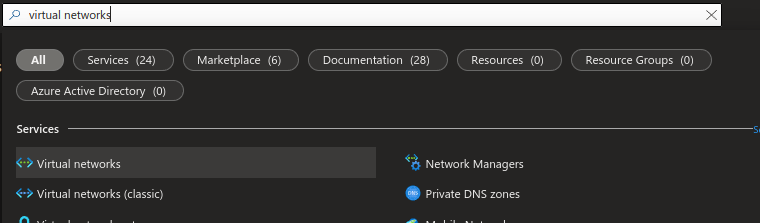
#### 4. Click on *Create*.
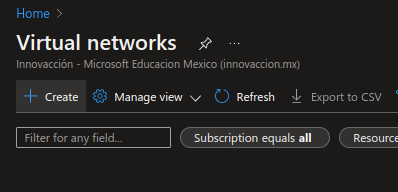
#### 5. You will first need to choose the suscription and resource group where you'll be storing your virtual network. In my case, I am creating a new resource group and I'll be storing my network in there.
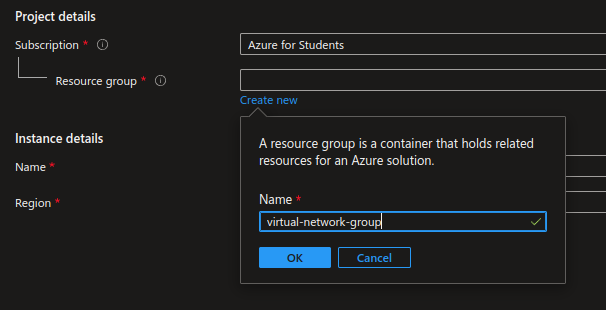
#### 6. Now, you have to configure the instance details: you just need a name and the region where you'll be hosting your virtual network.
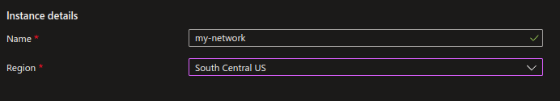
#### 7. Inside the IP Addresses tab, you are able to configure the address space as well as subnets. I won't be configuring anything in here.
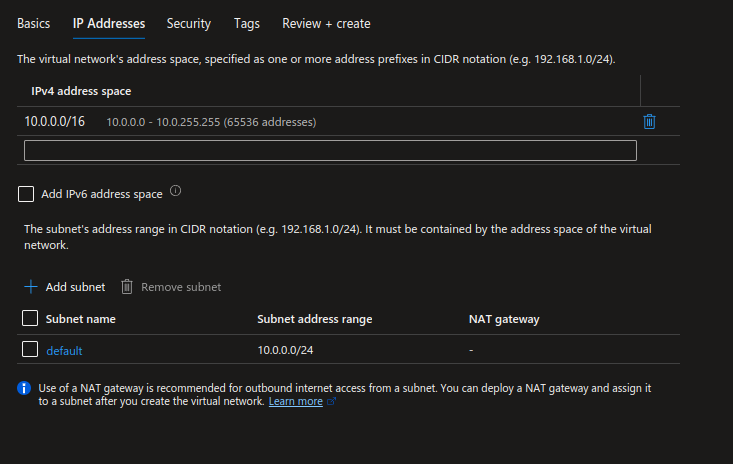
#### 8. Inside the security tab, you may also add protection to your network via Azure Bastion Host, DDoS  Protection and Firewall.
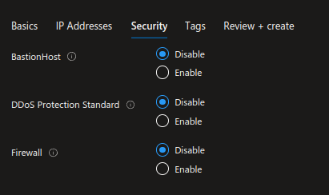
#### 9. In the tags section, you can add some tags in case you need them.
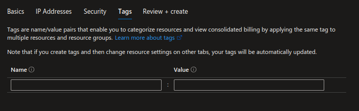
#### 10. Finally, click on *Review + create*.
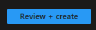
#### 11. If the validation passed, click on *Create*.
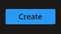
#### 12. Once deployment has been completed (which is usually really fast), you will se something like this:
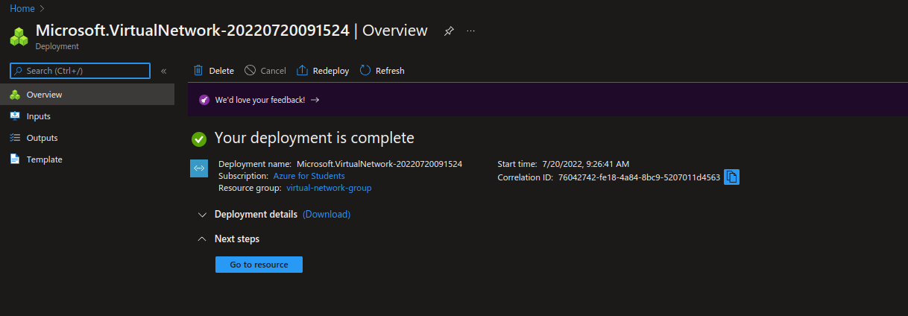
#### 13. Click on *Go to resource*.

#### 14. Your virtual network is now available and ready for configuration.
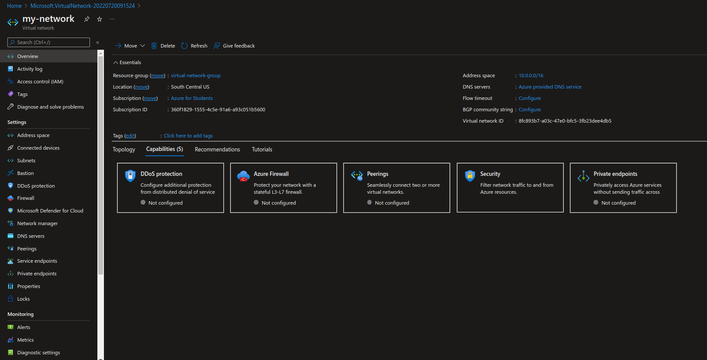

---------------------------------------------------------

## Congratulations ! You've just made your first virtual network using the Azure Portal !W
